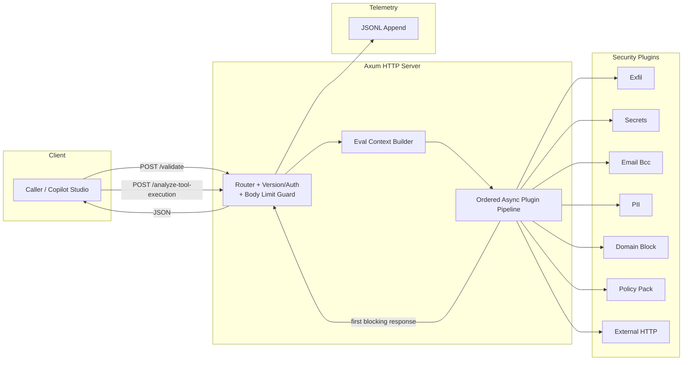
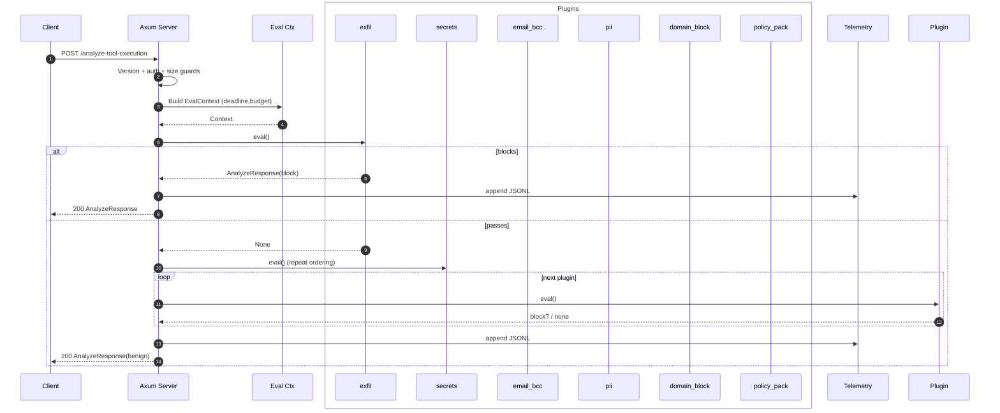

# Architecture

Minimal async (sequential / ordered) plugin pipeline behind the Microsoft Copilot Studio External Security Webhooks interface. One request in → single pass over plugins (await each) → first block wins → respond → append telemetry (optional). No job queue, streaming, fan‑out, or aggregation layers.

Wire schema follows the Copilot spec (camelCase externally, internal snake_case via serde rename). Additional internal endpoints (`/metrics`, `/healthz`) are exposed for operations.

## High-Level Flow

Diagram notes: no async fan‑out/concurrency inside the evaluation path; plugins are awaited sequentially inside the handler; backpressure comes from Axum/HTTP. External I/O (only the `external_http` plugin) occurs inline and is governed by a per‑plugin timeout.

## Request Lifecycle

### What Happens During a Request
1. **Guards**: ensure `api-version` is present, the bearer token is on the allowlist (if configured), and the request body stays under `SENTRA_MAX_REQUEST_BYTES` (handled by both a Content-Length check and Axum’s `DefaultBodyLimit`).
2. **Context build**: assemble precomputed lowercase text, chat history, and evaluation budget (`SENTRA_PLUGIN_BUDGET_MS`).
3. **Plugin loop**: execute plugins in the order supplied via `SENTRA_PLUGINS`. Each plugin is awaited; the first one returning `blockAction=true` short-circuits the loop unless audit-only mode is active. Network calls happen only in `external_http` and are constrained by per-definition timeouts.
4. **Response + telemetry**: reply with allow/block, capture structured diagnostics, emit JSONL telemetry and optional audit logs, and update Prometheus counters/histograms.

## Plugin Lineup

| Plugin | Purpose |
|--------|---------|
| `secrets` | Regex detection of AWS-style access keys. |
| `pii` | Emails, phones, IBANs, plus configurable keywords (Aho-Corasick cache). |
| `email_bcc` | Ensures BCC recipients use the company domain. |
| `domain_block` | Blocks configurable domains with boundary-aware matching. |
| `exfil` | Flags prompt-injection phrases (e.g., “ignore previous instructions”). |
| `policy_pack` | User-defined substring/regex rules from `SENTRA_PLUGIN_CONFIG`. |
| `external_*` | Posts templated JSON to remote services; supports `${userMessage}` and JSON-safe `${userMessageJson}` placeholders, fail-open/fail-closed behaviour, and pointer-based block detection. |

Add a plugin by implementing the trait, compiling it into `src/plugins/`, and adding its name to `SENTRA_PLUGINS`.

## Observability & Ops
- **JSONL telemetry**: one line per request (`schemaVersion`, `blockAction`, `reasonCode`, `blockedBy`, `pluginTimings`, `auditSuppressed`, `correlationId`). Configure with `LOG_FILE`, rotation knobs, and optional stdout mirroring (`SENTRA_LOG_STDOUT`, `SENTRA_LOG_SAMPLE_N`).
- **Audit log**: enabled automatically when `SENTRA_AUDIT_ONLY=1`, capturing the would-block response while the user-facing response stays benign.
- **Prometheus metrics**: `/metrics` exports request/block counters, audit suppression counter, overall & per-plugin latency histograms, telemetry write stats, log size gauge, build info, and uptime.
- **Health**: `/healthz` returns JSON summarising version, plugin count, and budget. Ready for Kubernetes `httpGet` probes.

## Endpoints
- `POST /validate?api-version=2025-05-01`
- `POST /analyze-tool-execution?api-version=2025-05-01`
- `GET /healthz`
- `GET /metrics`

## Code Layout
- `src/lib.rs` – router, handlers, shared state, telemetry + metrics wiring.
- `src/config.rs` – environment parsing.
- `src/util.rs` – precomputed request context, matcher caches, deadlines.
- `src/plugins/` – individual plugin implementations and pipeline assembly.
- `tests/` – unit + integration coverage, including HTTP round-trips and telemetry assertions.

## Configuration Hints
Environment variables control everything (see README cheatsheet). The important ones for production are:

| Variable | Why it matters |
|----------|----------------|
| `SENTRA_PLUGINS` | Defines evaluation order; first block wins. |
| `STRICT_AUTH_ALLOWED_TOKENS` | Locks down who can call the provider. |
| `SENTRA_MAX_REQUEST_BYTES` | Prevents resource abuse via oversized payloads. |
| `LOG_FILE`, `AUDIT_LOG_FILE` | Capture the decisions you’ll investigate later. |
| `SENTRA_AUDIT_ONLY` | Dry-run mode for safe rollout. |

## Spec Alignment
Sentra mirrors Microsoft’s external security webhook contract:
- CamelCase payload wire format (serde renaming keeps internals idiomatic).
- Required fields: `plannerContext.userMessage` and `toolDefinition.name` must be non-empty; errors use domain codes 4000/4001/4002/2001 as documented.
- Responses include `blockAction`, `reasonCode`, `reason`, `blockedBy`, and optional `diagnostics` exactly as the spec outlines.
- Correlation IDs from `x-ms-correlation-id` propagate into telemetry for traceability.

Run `cargo test` or hit the included Postman/HTTP examples under `examples/` to see real payloads end-to-end.
### Evolution Hooks
Pluggable telemetry backend, per‑plugin timeout guard, optional response signing.
