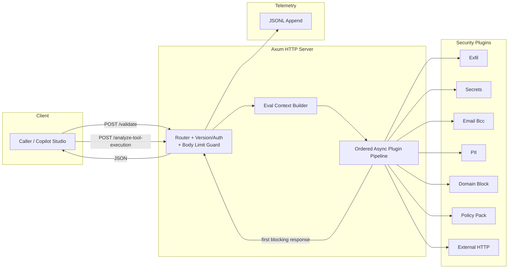
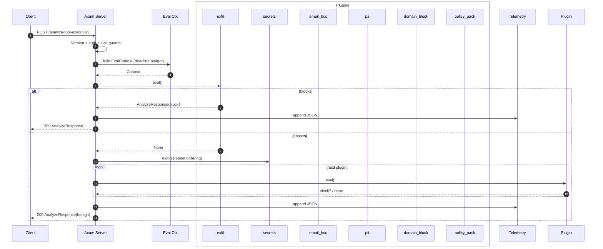

# Architecture

Minimal async (sequential / ordered) plugin pipeline behind the Microsoft Copilot Studio External Security Webhooks interface. One request in → single pass over plugins (await each) → first block wins → respond → append telemetry (optional). No job queue, streaming, fan‑out, or aggregation layers.

Wire schema follows the Copilot spec (camelCase externally, internal snake_case via serde rename). Additional internal endpoints (`/metrics`, `/healthz`) are exposed for operations.

## High-Level Flow



Diagram notes: no async fan‑out/concurrency inside the evaluation path; plugins are awaited sequentially inside the handler; backpressure comes from Axum/HTTP. External I/O (only the `external_http` plugin) occurs inline and is governed by a per‑plugin timeout.

## Request Lifecycle



### Steps
1. Parse & validate: `api-version`, auth (optional strict allowlist), and enforce request size. A `DefaultBodyLimit` layer rejects chunked bodies above `SENTRA_MAX_REQUEST_BYTES`, while a Content-Length check fast-fails when the header overflows the limit.
2. Build evaluation context (deadline from `SENTRA_PLUGIN_BUDGET_MS`) with shared precomputed strings for downstream plugins.
3. Iterate ordered plugin list (async trait methods awaited in sequence). External HTTP plugin may perform a network POST with a bounded timeout.
4. On first block: capture plugin name (`blockedBy`) + diagnostics; stop loop.
5. Compute timings, write telemetry/audit lines if configured.
6. Return response (benign or block). In audit-only mode the external response is always benign but an audit line records the would‑block decision.

### Concurrency & Backpressure
Tokio worker tasks handle requests start‑to‑finish. No internal queues. Deadline / soft budget (`SENTRA_PLUGIN_BUDGET_MS`) provides pressure relief. The pipeline stays sequential (no speculative parallel evaluation) to keep attribution deterministic and reduce contention.

### Error Handling
Plugin internal errors → treated as non‑blocking (prefer availability). Client 4xx reserved for version/auth/validation issues.

### Extensibility
Add plugin → implement trait + include in `SENTRA_PLUGINS`. Telemetry emission is centralized by `TelemetrySink`, so replacing or extending sinks avoids handler changes. The `external_http` plugin remains the generic bridge to remote services (e.g., Presidio) with a templated request body that now supports both raw `${…}` placeholders and JSON-safe variants like `${userMessageJson}` / `${toolNameJson}` for proper escaping.

### Observability
JSONL line per evaluation (`schemaVersion`, timings, decision, attribution, `auditSuppressed`). Prometheus metrics: request / block counters, audit suppression counter, histograms (request + per‑plugin), build info, process start & uptime gauges, log file size gauge, telemetry write error counter. Optional stdout mirroring with sampling. Log rotation retains configurable backups and can gzip the newest rollover.

---

The above diagrams complement existing textual architecture details, offering a visual and temporal understanding of how Sentra processes scan requests end-to-end.

## Components
* HTTP layer (`src/lib.rs`): routing, guards, handlers, metrics, telemetry writers.
* Plugin pipeline (`src/plugins/mod.rs`): sequential evaluation.
* Plugins (`src/plugins/*.rs`): pattern / rule checks + external HTTP bridge.
* Optional config file (policy pack rules, domains, keywords).

## Stack
Rust + Tokio + Axum, serde for (de)serialization, aho‑corasick / simple pattern checks, atomic counters for metrics assembly.

## Plugin Interface
Current implementation uses simple trait methods executed inline (no dynamic spawning per plugin). Each plugin returns allow/block + optional diagnostics payload.

### Data Flow (Summary)
Benign: iterate all → no block → telemetry (blockAction=false) → respond.
Blocking: stop at first block → telemetry with `blockedBy`/diagnostics → respond.
External: if `external_http` configured, it participates at its ordering position; a network error becomes either allow (fail‑open) or block (fail‑closed) depending on configuration.

### Concurrency Model
One handler loop per request; no per‑plugin tasks spawned.

### Memory
Primarily string scanning; telemetry serialized once per request.

### Configuration (Env)
See README for full list (plugins ordering, budgets, logging/rotation, audit, auth, size guard, optional config file). External plugin configuration is JSON‑driven (see example in `examples/*external*.json`).

### Security Notes
Memory safety from Rust, optional strict token allowlist, payload size cap, audit‑only safe rollout, structured telemetry for forensics.

## Telemetry Fields (JSONL)
`ts`, `correlationId`, `blockAction`, `reasonCode`, `blockedBy`, `latencyMs`, `diagnostics`, `pluginTimings`, `auditSuppressed`, and stable `schemaVersion`. Additional internal fields may appear (e.g., log rotation metadata) but existing keys retain semantics. See `DIAGNOSTICS.md` for structured diagnostics details and reason code legend.

### Audit Records
When audit mode suppresses a block an extra line with `auditOnly=true` + `wouldResponse` + original request is written to the audit log.

## Removed Prototype Features
Job queue, streaming (WebSocket/SSE), multi-plugin aggregation response mode, HTML UI were removed for simplicity.

## Possible Future Enhancements
Per-plugin timeout wrappers, alternative telemetry exporters, HMAC response signing, optional faster pattern engines.

## Implemented Endpoints
* `POST /validate?api-version=2025-05-01`
* `POST /analyze-tool-execution?api-version=2025-05-01`
* `GET /metrics` (Prometheus exposition)
* `GET /healthz` (liveness & basic readiness JSON)

### Request Handling Path

```
Axum Router
  -> validate_handler / analyze_handler (version + auth)
       -> build EvalContext (deadline)
          -> PluginPipeline::evaluate(request, ctx)
               (ordered plugin list, stops at first block)
             -> Individual plugin eval (pure, fast)
  <- JSON response serialized with camelCase field names
```

### Evaluation Model
First blocking plugin short‑circuits. Structural non‑empty detection is supported in the `external_http` plugin when a JSON Pointer (including root `/`) resolves to a non‑empty array/object and `nonEmptyPointerBlocks=true`.

### Telemetry JSONL
If `LOG_FILE` set: one line per request with decision + timings. Audit‑only mode writes both the would‑block decision (audit line) and the externally visible allow decision.

| Field | Description |
|-------|-------------|
| `ts` | RFC3339 UTC timestamp |
| `correlationId` | From `x-ms-correlation-id` header (or empty) |
| `blockAction` | Final block decision |
| `reasonCode` | Blocking plugin code |
| `blockedBy` | Plugin identifier responsible for the decision |
| `latencyMs` | Milliseconds from handler start to decision |
| `diagnostics` | Same string returned to client |
| `pluginTimings` | Array of `{plugin, ms}` objects (observability) |
| `auditSuppressed` | Included when audit-only masked a block |

### Strict Auth
Optional token allowlist (comma separated). Reject → 401 `errorCode=2001`.

### Request Size Enforcement
`SENTRA_MAX_REQUEST_BYTES` drives both the Content-Length preflight check and Axum's `DefaultBodyLimit` guard. Oversized payloads, including chunked bodies with no length header, receive a structured 413 (`errorCode=4001`) and a warning is emitted for telemetry.

### Version Compatibility
Unknown versions accepted (logged). Missing → 400.

### Performance
CPU‑bound string / pattern scans; no external I/O in evaluation path. Size guard + deadline + warn threshold. Telemetry append best effort.

### Evolution Hooks
Pluggable telemetry backend, per‑plugin timeout guard, optional response signing.
